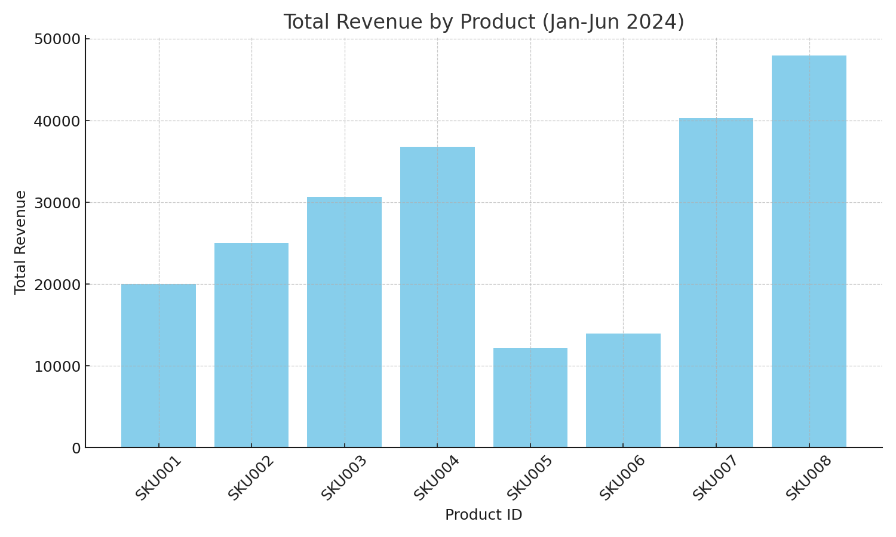
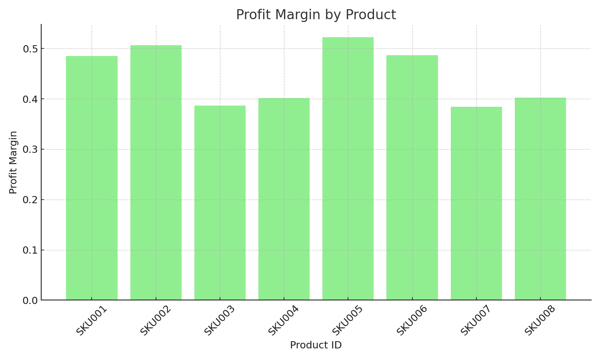
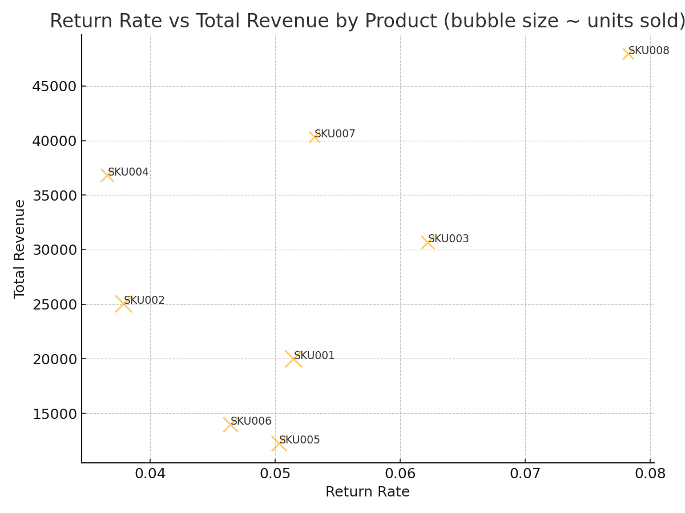
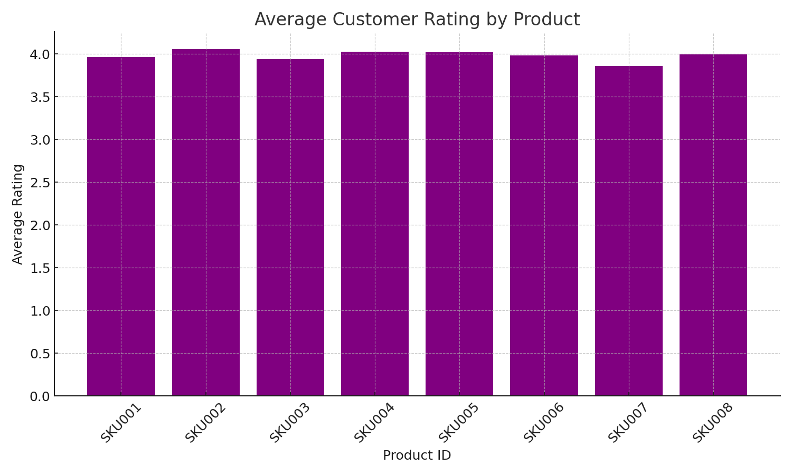
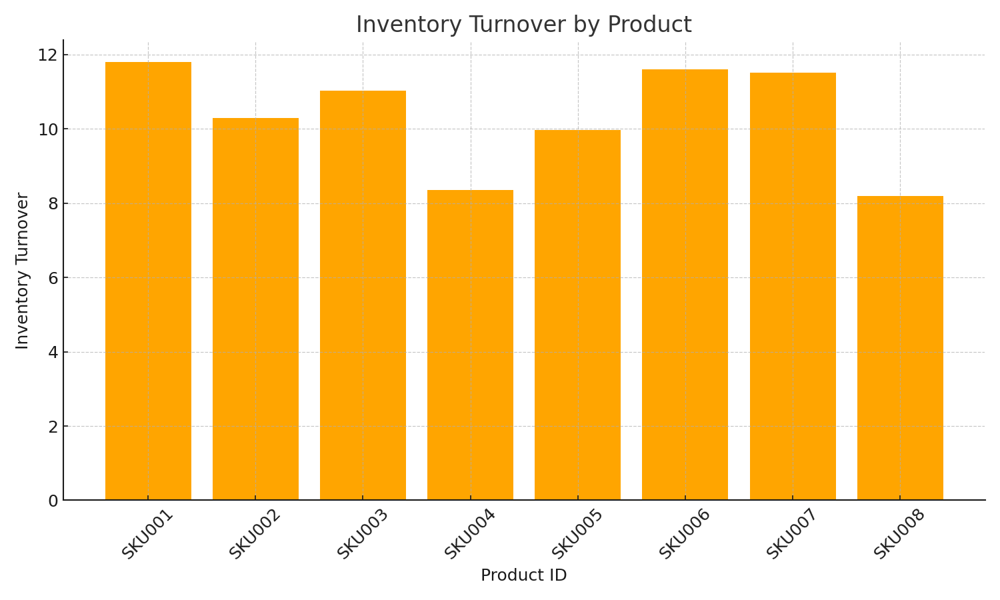
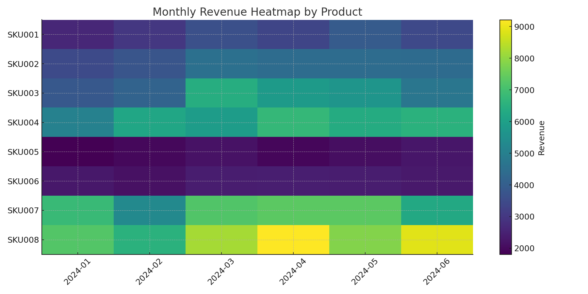
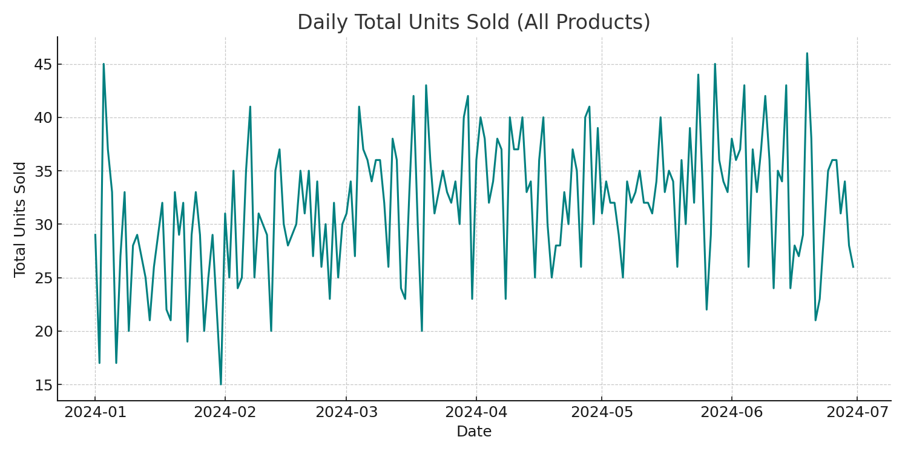
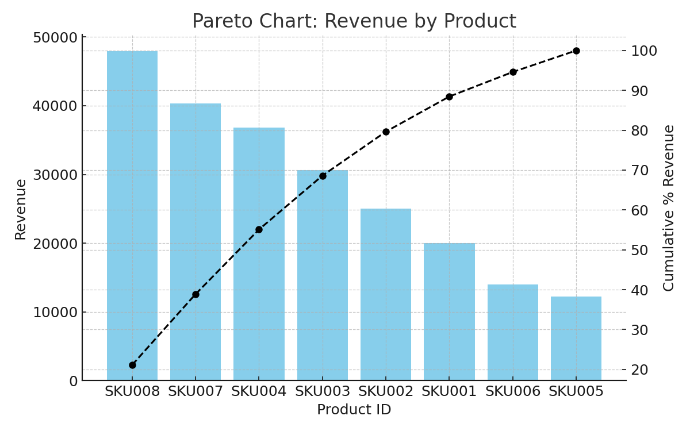

# 🛍️ E-commerce Product Analysis

This repository conducts a comprehensive product-level analysis in an e-commerce context using synthetic data for Jan–Jun 2024. It demonstrates business acumen, analytical capacity, and strategic thinking by evaluating key product KPIs and generating actionable insights.

---

## 📌 Introduction & Objectives

**Introduction:**  
In competitive e-commerce environments, understanding product performance at a granular level is crucial. This analysis uses synthetic data to simulate daily transactions, promotions, and seasonality, focusing on product profitability, returns, inventory efficiency, and customer satisfaction.

**Objectives:**  
- **Assess Product Performance:** Evaluate total revenue, profit margin, and category contributions.  
- **Identify Risk Factors:** Analyze return rates and their impact on profitability.  
- **Optimize Operations:** Examine inventory turnover for efficient stock management.  
- **Leverage Customer Insights:** Investigate average customer ratings to guide improvements.  
- **Strategic Planning:** Use trend and seasonality analysis to inform promotions, pricing, and portfolio decisions.

---

## 📊 Data & KPIs

- **Data Source:** Synthetic daily product sales data (`data/product_data.csv`), including fields: `date`, `product_id`, `product_name`, `category`, `units_sold`, `price`, `revenue`, `cost`, `profit`, `returns`, `avg_rating`.  
- **Key KPIs Computed:**  
  - **Total Revenue** per product  
  - **Gross Profit Margin** (profit/revenue)  
  - **Return Rate (%)** (returns/units_sold)  
  - **Inventory Turnover** (simulated: COGS/avg_inventory)  
  - **Average Customer Rating**  
  - **Units Sold Trends** (daily and monthly)  
  - **Category-Level Aggregates**  

---

## 🛠️ Tools & Technologies

- **Python**: pandas, numpy, matplotlib  
- **Jupyter Notebooks**: Step-by-step exploration (`notebooks/`)  
- **Power BI & Tableau**: (static dashboard images in `dashboards/` for mockups)  
- **GitHub Actions**: Notebook linting with nbQA  
- **Version Control**: Git & GitHub  

---

## 📈 Analysis & Dashboards

All dashboard images reside in the `dashboards/` folder. Each section includes the chart and interpretive commentary.

### 1. Revenue & Profit Analysis

#### Revenue by Product


- **Analysis:**  
  - Identifies top revenue-generating SKUs, indicating primary drivers of sales.  
  - Compare performance across categories to determine focus areas.  
- **Insight:**  
  - Prioritize marketing spend and inventory allocation for top revenue products.  
  - Investigate lower-revenue products: consider promotions, bundling, or phasing out.

#### Profit Margin by Product


- **Analysis:**  
  - Shows relative profitability; some high-revenue products may have lower margins due to costs or discounts.  
  - Highlights high-margin products that can be scaled.  
- **Insight:**  
  - Focus on high-margin SKUs for profitability growth.  
  - For low-margin items, review pricing strategy or cost structure (supplier negotiations, packaging).

### 2. Return Rate & Customer Satisfaction

#### Return Rate vs Total Revenue


- **Analysis:**  
  - Scatter plot bubbles sized by units sold: reveals products with high sales but high return rates, which erode profit.  
  - Low-revenue but high-return products may indicate quality issues or misaligned expectations.  
- **Insight:**  
  - Investigate high-return SKUs: analyze return reasons, improve product descriptions, quality checks.  
  - Balance inventory reduction for persistently high-return items to minimize losses.

#### Average Rating by Product


- **Analysis:**  
  - Illustrates customer satisfaction; low-rated products may harm brand reputation and increase returns.  
- **Insight:**  
  - For low-rated items, gather customer feedback to make improvements.  
  - Highlight high-rated products in marketing to build trust and increase conversions.

### 3. Inventory & Turnover

#### Inventory Turnover by Product


- **Analysis:**  
  - Simulated turnover indicates how quickly inventory is sold relative to average stock.  
  - Low turnover SKUs tie up capital and incur holding costs; high turnover indicates strong demand but risk of stockouts.  
- **Insight:**  
  - Adjust reorder points: reduce inventory for slow-moving items; increase safety stock for fast-moving SKUs.  
  - Consider promotional pushes for low-turnover products to clear inventory or bundle with popular items.

### 4. Trend & Seasonality

#### Monthly Revenue Heatmap by Product


- **Analysis:**  
  - Visualizes monthly revenue per SKU; reveals seasonal patterns or campaign impacts.  
  - Identify months with peak demand for specific products.  
- **Insight:**  
  - Schedule promotions or inventory restocking aligned with peak months.  
  - For products showing declining trends, investigate market shifts or competitor actions.

#### Daily Units Sold Trend


- **Analysis:**  
  - Overall daily sales volume trend; highlights spikes (e.g., promotions) or dips (e.g., seasonality).  
- **Insight:**  
  - Use trend data to plan marketing campaigns around high-traffic periods.  
  - Monitor dips to proactively introduce offers or adjust pricing.

### 5. Pareto & Category-Level Insights

#### Pareto Analysis: Revenue by Product


- **Analysis:**  
  - Shows cumulative revenue contribution: typically top ~20% of products drive ~80% of revenue.  
- **Insight:**  
  - Focus strategic efforts (marketing, inventory, R&D) on top-performing SKUs.  
  - Evaluate whether low-contribution products justify continued support or need rationalization.

#### Revenue by Category (Notebook Visualization)
*(In `notebooks/03_product_performance.ipynb`, a bar chart aggregates revenue by category)*

- **Analysis:**  
  - Understand category-level performance to inform assortment planning and category-focused campaigns.  
- **Insight:**  
  - Invest in high-performing categories; develop strategies to boost underperforming categories.

---

## 📂 Project Structure

```
ecommerce-product-analysis/
├── data/
│   ├── product_data.csv         # Synthetic data
│   └── product_summary.csv      # Aggregated KPIs
├── dashboards/
│   ├── revenue_by_product.png
│   ├── profit_margin_by_product.png
│   ├── return_rate_vs_revenue.png
│   ├── monthly_revenue_heatmap.png
│   ├── inventory_turnover_by_product.png
│   ├── avg_rating_by_product.png
│   ├── pareto_revenue_by_product.png
│   └── daily_units_sold.png
├── scripts/
│   ├── generate_product_data.py
│   ├── analyze_products.py
│   └── visualize_product_performance.py
├── notebooks/
│   ├── 01_data_ingestion_and_cleaning.ipynb
│   ├── 02_exploratory_analysis.ipynb
│   ├── 03_product_performance.ipynb
│   ├── 04_inventory_and_returns.ipynb
│   └── 05_actionable_insights_and_recommendations.ipynb
├── docs/
│   ├── project_overview.md
│   └── methodology.md
├── .github/
│   └── workflows/
│       └── lint_notebooks.yml
├── requirements.txt
├── LICENSE
└── README.md                    # This file
```

---

## 🚀 Conclusions & Strategic Recommendations

- **Prioritize High-Impact SKUs:**  
  Focus marketing, inventory, and development on top revenue and high-margin products. This demonstrates business acumen in resource allocation for maximum ROI.
- **Mitigate Return Risks:**  
  Identify and address root causes of high return rates via quality improvements, better packaging, and clearer product descriptions—highlighting analytical capacity in diagnosing issues.
- **Optimize Inventory Management:**  
  Use inventory turnover insights to set dynamic reorder points: reduce capital tied in slow-moving items and avoid stockouts for fast-sellers, reflecting strategic thinking in operations.
- **Leverage Customer Feedback:**  
  Act on average rating analyses: improve or phase out low-rated SKUs and promote high-rated products, showing customer-centric strategy.
- **Seasonal & Trend-Based Planning:**  
  Align promotions and stock planning with observed seasonality and daily sales trends, showcasing foresight and strategic planning skills.
- **Portfolio Rationalization:**  
  Employ Pareto analysis to rationalize product lineup: maintain a lean portfolio focused on top performers while evaluating underperformers for potential discontinuation.

---

## 📌 How to Use

1. **Clone the Repository:**  
   ```bash
   git clone <repo_url>
   cd ecommerce-product-analysis
   ```
2. **Install Dependencies:**  
   ```bash
   pip install -r requirements.txt
   ```
3. **Generate or Load Data:**  
   - Run `scripts/generate_product_data.py` to regenerate synthetic data.  
   - Or use existing `data/product_data.csv`.
4. **Run Analysis:**  
   - Open and run notebooks in the `notebooks/` folder for detailed exploration.  
   - Use scripts:  
     ```bash
     python scripts/analyze_products.py
     python scripts/visualize_product_performance.py
     ```
5. **Review Dashboards:**  
   - View static charts in `dashboards/`.  
   - Optionally recreate interactive dashboards in Tableau/Power BI using the CSV data.
6. **Customize & Extend:**  
   - Replace synthetic data with real e-commerce product data.  
   - Add advanced analytics: predictive demand forecasting, pricing optimization, recommendation systems.
7. **Share & Present:**  
   - Highlight findings and strategic recommendations in stakeholder presentations or application portfolios.

---

## 📬 Contact & Collaboration

For questions or suggestions, open an issue or reach out via GitHub. This project reflects strong strategic understanding, data-driven decision-making, and the ability to translate analysis into business actions—key skills for analytical roles.

